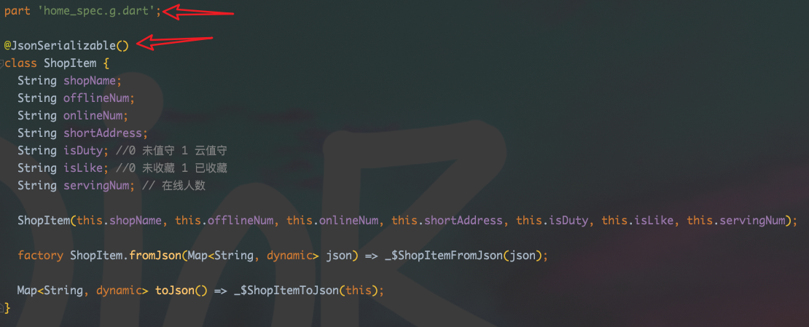

# scan_cannon

A new Flutter project.

## Getting Started

This project is a starting point for a Flutter application.

A few resources to get you started if this is your first Flutter project:

- [Lab: Write your first Flutter app](https://docs.flutter.dev/get-started/codelab)
- [Cookbook: Useful Flutter samples](https://docs.flutter.dev/cookbook)

For help getting started with Flutter development, view the
[online documentation](https://docs.flutter.dev/), which offers tutorials,
samples, guidance on mobile development, and a full API reference.

## 如何切换Flutter版本

找到shell/flutterv.sh

在控制台运行 ./flutter ${flutter version}

```
./flutterv.sh 3.0.4
```
## Cannot run with sound null safety解决方案

在AndroidStudio或IDEA->Run->Edit Configurations

Additional run args 填入命令：--no-sound-null-safety

## 如何支持Class的Json转换

在pubspec.yaml中加入依赖

```
dependencies:
    json_serializable: ^6.3.1
    json_annotation: ^4.6.0
    build_runner: ^2.1.11
```
新建class文件，在对应的class文件中加入part及@JsonSerializable()注解



在控制台运行命令，如果运行失败，在命令后加上 --delete-conflicting-outputs

新建
```
flutter packages pub run build_runner build
```
修改
```
flutter packages pub run build_runner watch
```

build
```
flutter build apk  --no-sound-null-safety
```

ios调试
```
flutter run --release
```
## 运行报splash相关异常解决办法
```
> Execution failed for task ':app:processDebugResources'.
> A failure occurred while executing com.android.build.gradle.internal.res.LinkApplicationAndroidResourcesTask$TaskAction
> Android resource linking failed
> ERROR:/Users/nateyang/Documents/GitHub/zee_app/android/app/src/main/res/drawable-v21/launch_background.xml:4: AAPT: error: resource drawable/background (aka com.entysquare.zee_app:drawable/background) not found.
> ERROR:/Users/nateyang/Documents/GitHub/zee_app/android/app/src/main/res/drawable-v21/launch_background.xml:7: AAPT: error: resource drawable/splash (aka com.entysquare.zee_app:drawable/splash) not found.
```
运行splash create命令
```
flutter pub run flutter_native_splash:create
```